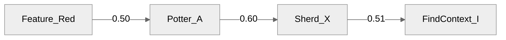

# Potter Attribution example — typological dating chain

This example demonstrates AMT.engine reasoning over an archaeological
attribution scenario. Pottery sherds carry **features** (figure types
or diagnostic shapes) that can be attributed to individual **potters**.
Potters in turn have an active period, which lets us derive a probable
**dating** for the **find context** in which a sherd was excavated.

The interesting thing happens when we compose these binary attributions
into a single feature-to-context inference: a long chain of moderate
confidences quickly collapses under naive Product logic, but stays
meaningful under Einstein product.

Run it with:

```bash
python -m amt.runner examples/PotterAttributionExample.ttl
```

## Concepts and roles

Four concepts form the attribution chain:

```mermaid
---
config:
  layout: elk
  theme: neutral
---
flowchart LR
    Feature["ex:Feature<br/>(figure type)"]
    Potter["ex:Potter"]
    Sherd["ex:Sherd"]
    Context["ex:FindContext"]

    Feature -->|"FeatureAttributionDegree"| Potter
    Potter  -->|"PotterAttributionDegree"|  Sherd
    Sherd   -->|"WeightedDatingDegree"|     Context

    Feature -.->|"FigureTypeRepertoireChoice<br/>(derived)"| Sherd
    Potter  -.->|"DatingWeight<br/>(derived)"|              Context
    Feature -.->|"FeatureDatingWeight<br/>(derived)"|       Context

    classDef asserted fill:#e3f2fd,stroke:#1565c0
    classDef derived  fill:#fff3e0,stroke:#e65100
    class Feature,Potter,Sherd,Context asserted
```

Solid arrows are asserted; dashed arrows are derived by role-chain
axioms. The three derived roles correspond to the three composed
inferences this example produces.

## The data

Two attribution branches with very different confidence profiles —
useful for comparing how the operators behave at different parts of
the [0,1] range.

### Branch A: low-to-medium confidence



Every link is in the 0.5–0.6 range — the kind of evidence where each
individual fact is "more likely than not", but a long chain of them
should not yield high confidence. Product logic on the full chain
gives 0.50 × 0.60 × 0.51 ≈ 0.153.

### Branch B: high-confidence chain with weak features


Potter_B is well-attested. Two features are attributed to him with
very different confidences: Feature_Blue is certain (1.00),
Feature_Green is weak (0.33). The downstream sherd and dating links
are solid. This branch shows how the operators handle a chain where
one link is much weaker than the others.

## Axioms used

Three `RoleChainAxiom`s — two binary, one ternary. The choice of logic
matters most for the three-step axiom, which is where Product would
otherwise damp results into the noise floor.

| Axiom | Logic | Why this logic |
|-------|-------|----------------|
| `RCA_repertoireChoice`<br>`FeatureAttributionDegree ∘ PotterAttributionDegree → FigureTypeRepertoireChoice` | **Product** | Two independent attribution observations (typological + provenance). Their confidences multiply — a 0.5 belief and a 0.6 belief combine into 0.30. |
| `RCA_potterDating`<br>`PotterAttributionDegree ∘ WeightedDatingDegree → DatingWeight` | **Product** | Same reasoning across the dating boundary. Independent evidence sources (style attribution and stratigraphic dating) compose multiplicatively. |
| `RCA_featureDating`<br>`FeatureAttributionDegree ∘ PotterAttributionDegree ∘ WeightedDatingDegree → FeatureDatingWeight` | **EinsteinProduct** | A length-3 chain on a different consequent role. Einstein is a strict t-norm that returns slightly lower values than Product across (0,1)^n, so it both makes the long-chain inferences distinguishable from the binary Product chains in the output, and applies an explicit (small) penalty for chain length. |

## Expected inferences

After running the pipeline you should see **8 inferred edges**.

### From `RCA_repertoireChoice` (3 edges, Product)

| Source | Target | Weight | Derivation |
|--------|--------|--------|------------|
| `Feature_Red`   | `Sherd_X` | 0.300 | 0.50 × 0.60 |
| `Feature_Blue`  | `Sherd_Z` | 0.830 | 1.00 × 0.83 |
| `Feature_Green` | `Sherd_Z` | 0.274 | 0.33 × 0.83 |

### From `RCA_potterDating` (2 edges, Product)

| Source | Target | Weight | Derivation |
|--------|--------|--------|------------|
| `Potter_A` | `FindContext_I` | 0.306 | 0.60 × 0.51 |
| `Potter_B` | `FindContext_I` | 0.498 | 0.83 × 0.60 |

### From `RCA_featureDating` (3 edges, Einstein product)

| Source | Target | Weight | Derivation (Einstein) | For comparison: Product |
|--------|--------|--------|-----------------------|--------------------------|
| `Feature_Red`   | `FindContext_I` | 0.093 | E(0.50, 0.60, 0.51) | 0.153 |
| `Feature_Blue`  | `FindContext_I` | 0.466 | E(1.00, 0.83, 0.60) | 0.498 |
| `Feature_Green` | `FindContext_I` | 0.113 | E(0.33, 0.83, 0.60) | 0.164 |

The Einstein values are computed by reducing the t-norm
`E(x,y) = xy / (1 + (1-x)(1-y))` left-to-right across the chain.

## A note on operator choice

A common assumption is that "Einstein is gentler than Product".
Looking at this table, it isn't — Einstein returns *lower* values
than Product on every input here, and that holds across the whole
(0,1)² square: the Einstein t-norm is strictly bounded above by
Product everywhere except at the corners. The two are close near
the high end and diverge in the mid-range.

So why use Einstein at all? Two reasons that apply to this example:

1. **Distinguishability in the output.** Using Product for both the
   binary chains and the ternary chain would make the inferred edges
   indistinguishable in style — you couldn't tell at a glance which
   ones came from which axiom. Picking a different t-norm for the
   long chain makes the provenance visible in the weights themselves.
2. **Explicit chain-length penalty.** If your modelling decision is
   "long chains should be penalised more than just multiplicatively
   would suggest", Einstein is one of several strict-Archimedean
   t-norms that do this in a principled way. Hamacher (with γ < 1)
   and Yager (with q > 1) also fit this pattern.

For "two independent observations multiply", as in the binary axioms
above, Product remains the natural choice. The semantic question for
the ternary axiom is whether the chain elements are independent
multiplicative evidence (use Product) or whether they're a derivation
where some non-multiplicative shape is appropriate (use Einstein,
GeometricMean, or — if you want a strict floor — Łukasiewicz).

## Comparing on a longer chain

If you want to see operator differences more dramatically, lengthen
the chain. The `animals.ttl` example uses **GeometricMean** for its
4-step ancestry chain — geometric mean is the right call when you
want the result to behave like an "average confidence per link"
rather than a multiplicative product. On `(0.92, 0.92, 0.95, 0.97)`
geometric mean gives 0.94 while Product gives 0.78.

Different operators, different domains, same underlying tradeoff:
how harshly should chain length count against the result? The
choice is a domain modelling decision and should be motivated by
what the chain *means* in the data, not by what number you'd like
to come out.
