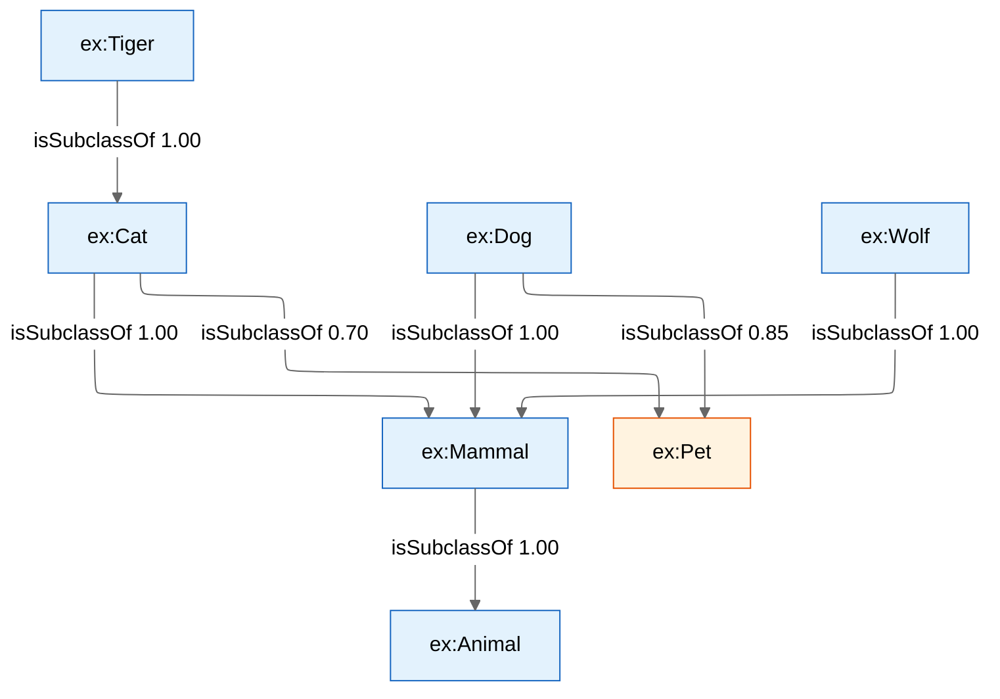
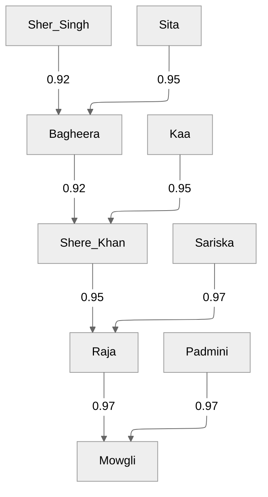
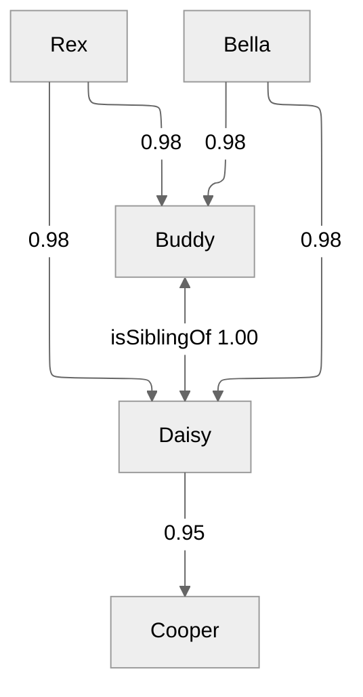
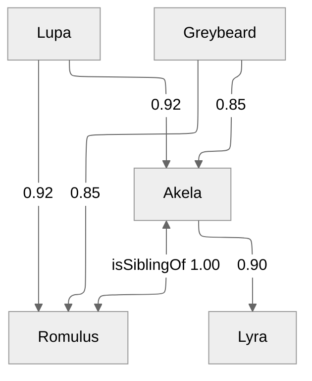

# Animals example — taxonomy meets family tree

This example demonstrates AMT.engine reasoning over two intertwined
domains: a biological **taxonomy** and a real **family tree** of
individual animals. The interesting thing happens at the intersection
of the two — once we know that *Mowgli is a Tiger* and *Tiger is
classified as a Cat*, the engine derives that *Mowgli is a Cat*,
and from there *Mowgli is a Mammal* and *Mowgli is an Animal*.

Run it with:

```bash
python -m amt.runner examples/animals.ttl
```

## Taxonomy

Seven species form a small classification hierarchy. Biological
relationships are asserted at confidence 1.0; the cultural category
**Pet** is fuzzier, because not every domestic animal is universally
considered a pet, and obviously not every cat (e.g. tiger).



## Family trees

Three families demonstrate different chain depths and confidence
profiles. Tiger paternity is assumed less certain than dog pedigree;
wolf paternity is the least certain because the data comes from
field observation, not DNA tests.

### Tigers (5 generations — exercises the 4-step `GeometricMean` axiom)



All edges shown are `isParentOf`. The chain `Sher_Singh → Bagheera →
Shere_Khan → Raja → Mowgli` is the canonical 4-step example for the
`GeometricMean` axiom.

### Dogs (3 generations — exercises 2-step `Product` and the symmetric `isSiblingOf`)



### Wolves (3 generations, lower confidence — shows logic differences)



## Axioms used

Four `RoleChainAxiom`s plus three `InverseAxiom`s. Each logic is chosen
for what it actually *means* in the domain, not just to demonstrate the
operator. `Łukasiewicz`, `EinsteinProduct` and `HamacherProduct` are
intentionally absent — they don't have a natural place in this
particular domain. The test suite covers them separately.

| Axiom | Logic | Why this logic |
|-------|-------|----------------|
| `RCA_classTrans`<br>`isSubclassOf ∘ isSubclassOf → isSubclassOf` | **Goedel** | Classification chains compose by their weakest link. Two confident facts give a confident result; a weak link drags the conclusion down. |
| `RCA_classCrossover`<br>`isInstanceOf ∘ isSubclassOf → isInstanceOf` | **Goedel** | Same reasoning across the role boundary: if Mowgli is certainly a Tiger and Tiger is certainly a Cat, Mowgli is certainly a Cat. |
| `RCA_grandparent`<br>`isParentOf ∘ isParentOf → isAncestorOf` | **Product** | Two independent parent observations multiply: a 0.95 belief and a 0.92 belief give 0.874 — captures cumulative evidential strength. |
| `RCA_longAncestry`<br>`isParentOf ⁴ → isAncestorOf` | **GeometricMean** | At length 4, Product would dampen the chain too aggressively (0.92×0.92×0.95×0.97 ≈ 0.78). Geometric mean keeps the result around 0.94 — far more representative of "this is almost certainly an ancestor". |
| `IA_subclassReverse` | (inverse) | Every `isSubclassOf` produces the reverse `hasSubclass`. |
| `IA_ancestorReverse` | (inverse) | Every `isAncestorOf` produces the reverse `isDescendantOf`. |
| `IA_siblingSym` | (inverse) | `isSiblingOf` is symmetric — its inverse is itself. |

## Expected inferences

After running the pipeline on this file, you should see **106
inferred edges** in the output. The key derivations:

### From `RCA_classTrans` (taxonomy transitivity)

Six new `isSubclassOf` edges, all derived by Goedel/min:

| Source | Target | Weight | Derivation |
|--------|--------|--------|------------|
| `Tiger` | `Mammal` | 1.00 | min(Tiger→Cat=1.0, Cat→Mammal=1.0) |
| `Tiger` | `Animal` | 1.00 | via `Tiger→Mammal=1.0`, `Mammal→Animal=1.0` |
| `Cat` | `Animal` | 1.00 | min(1.0, 1.0) |
| `Dog` | `Animal` | 1.00 | min(1.0, 1.0) |
| `Wolf` | `Animal` | 1.00 | min(1.0, 1.0) |
| `Tiger` | `Pet` | 0.70 | min(Tiger→Cat=1.0, Cat→Pet=0.70) — see "Pet caveat" below |

### From `RCA_classCrossover` (61 edges)

Every individual gets membership in every class above its species.
Highlights:

| Source | Target | Weight | Derivation |
|--------|--------|--------|------------|
| `Mowgli` | `Cat` | 1.00 | min(Mowgli→Tiger=1.0, Tiger→Cat=1.0) |
| `Mowgli` | `Mammal` | 1.00 | (after Tiger→Mammal exists) |
| `Mowgli` | `Animal` | 1.00 | |
| `Buddy` | `Pet` | 0.85 | min(Buddy→Dog=1.0, Dog→Pet=0.85) |
| `Akela` | `Mammal` | 1.00 | |
| `Akela` | `Animal` | 1.00 | |

Note: **`Akela` does not get classified as `Pet`** — the wolf taxonomy
chain has no `Pet` edge, so the Goedel axiom doesn't fire. That's the
intended behaviour: wolves are not (typically) pets.

### From `RCA_grandparent` (10 edges, Product logic)

| Source | Target | Weight | Derivation |
|--------|--------|--------|------------|
| `Sher_Singh` | `Shere_Khan` | 0.846 | 0.92 × 0.92 |
| `Sita` | `Shere_Khan` | 0.874 | 0.95 × 0.92 |
| `Bagheera` | `Raja` | 0.874 | 0.92 × 0.95 |
| `Kaa` | `Raja` | 0.903 | 0.95 × 0.95 |
| `Shere_Khan` | `Mowgli` | 0.922 | 0.95 × 0.97 |
| `Sariska` | `Mowgli` | 0.941 | 0.97 × 0.97 |
| `Rex` | `Cooper` | 0.931 | 0.98 × 0.95 |
| `Bella` | `Cooper` | 0.931 | 0.98 × 0.95 |
| `Lupa` | `Lyra` | 0.828 | 0.92 × 0.90 |
| `Greybeard` | `Lyra` | 0.765 | 0.85 × 0.90 |

### From `RCA_longAncestry` (2 edges, Geometric Mean)

| Source | Target | Weight | Derivation |
|--------|--------|--------|------------|
| `Sher_Singh` | `Mowgli` | 0.940 | (0.92 × 0.92 × 0.95 × 0.97)^(1/4) |
| `Sita` | `Mowgli` | 0.947 | (0.95 × 0.92 × 0.95 × 0.97)^(1/4) |

For comparison, **Product** on the same chain would give 0.78 — the
single most striking demonstration in this example of why operator
choice matters at long chain lengths.

### From inverse axioms

- 13 `hasSubclass` edges (one per asserted/inferred `isSubclassOf`)
- 12 `isDescendantOf` edges (one per inferred `isAncestorOf`)
- 2 sibling-symmetry edges (`Daisy → Buddy`, `Romulus → Akela`)

## A modelling caveat: the `Pet` confidence

A few inferred edges look semantically odd:

- `Tiger isSubclassOf Pet` at 0.70
- `Sher_Singh isInstanceOf Pet` at 0.70 (a tiger ancestor!)

These come out because we asserted `Cat isSubclassOf Pet` at 0.70.
Goedel composition then puts every Cat (including Tiger) and every
Tiger individual at confidence ≤ 0.70 in the Pet category. The engine
isn't being silly — it's faithfully propagating the modelled belief.

There are two ways to fix this if it bothers you in your own data:

1. **Drop the `Cat isSubclassOf Pet` edge entirely.** "Cat" as a taxon
   includes tigers; "domestic cat" would be the right Pet candidate.
   Cleaner, but loses information about house cats being pets.
2. **Introduce a separate `DomesticCat` species** that `isSubclassOf
   Cat` and `isSubclassOf Pet`, and assert `Buddy_the_house_cat
   isInstanceOf DomesticCat`. More accurate, more nodes.

The example keeps the simpler model on purpose — it shows that
confidence weights are not magic and that the engine produces exactly
what the modeller asked for. Picking confidence values is a domain
modelling decision, and surprising results in the output usually
indicate a missing distinction in the input.

## Three-step ancestor gap (intentional)

The example **does not** include a 3-step `isParentOf` axiom. So
relationships like *Sher_Singh is the great-grandparent of Raja* are
not derived as `isAncestorOf` directly — they exist only via the 2-step
grandparent rule (Sher_Singh → Shere_Khan via grandparent gives
weight 0.846, then Shere_Khan → Raja already exists as the asserted
`isParentOf` 0.95, but no axiom composes the two into Sher_Singh →
Raja).

If you want full transitive ancestry, add an axiom:

```turtle
ex:RCA_ancestorTrans rdf:type        amt:RoleChainAxiom ;
                     amt:antecedents ( ex:isAncestorOf ex:isAncestorOf ) ;
                     amt:consequent  ex:isAncestorOf ;
                     amt:logic       amt:GoedelLogic .
```

This would cover all chain lengths automatically. It's omitted here to
keep the example focused on showing **why operator choice matters**
rather than building a complete genealogy reasoner.
