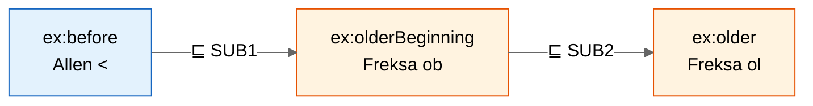
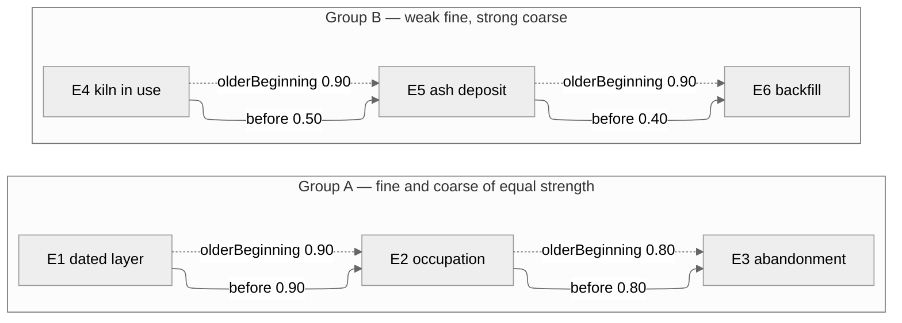

# Subsumption example — coarse and fine temporal relations

This example demonstrates `amt:SubsumptionAxiom`: a statement that one role
is *finer* than another, so that every edge carrying the fine role also
carries the coarse one, at no lower weight.

Run it both ways and compare:

```bash
python run_amt.py subsumption-demo.ttl
python run_amt.py subsumption-demo.ttl --minimal
```

Each run lands in its own `out/run-YYYYMMDD-HHMMSS/` folder, so you can put
the two `subsumption-demo.edges.csv` files side by side and diff them.

## Why the axiom exists

Some vocabularies define roles as *sets* of finer roles. Freksa (1992),
*Temporal reasoning based on semi-intervals*, extends Allen's thirteen
interval relations with sixteen conceptual neighbourhoods, each of which is
a set of Allen relations:

| Role | Allen set | Reading |
|------|-----------|---------|
| `<`  | {`<`} | strictly before |
| `ob` | {`<`, `m`, `o`} | older beginning |
| `ol` | {`<`, `m`, `o`, `fi`, `di`} | older |
| `?`  | all thirteen | no information |

Set inclusion gives a subsumption chain `< ⊂ ob ⊂ ol ⊂ ?`. Across the full
29-role vocabulary there are 137 such proper subset relations. Without a way
to express them, a reasoner derives every member of a chain independently:
all of them true, all but the finest redundant — and `?` is worse than
redundant, because it asserts that nothing is known about a pair for which
something *is* known.

This file is a three-role miniature of that situation:



Only the covering relation is declared. `before ⊑ older` follows from the
transitive closure, which the engine computes itself — a file may spell out
every pair or only the links, and the result is the same.

## Axioms

| IRI | Type | Content | Why this operator |
|-----|------|---------|-------------------|
| `SUB1` | SubsumptionAxiom | `before ⊑ olderBeginning` | — |
| `SUB2` | SubsumptionAxiom | `olderBeginning ⊑ older` | — |
| `CHAIN1` | RoleChainAxiom | `before ∘ before → before` | Gödel. Composing temporal relations loses no confidence beyond the weakest link, and chain length is not itself evidence against the conclusion, so a length-penalising operator such as Product would be wrong here. |
| `CHAIN2` | RoleChainAxiom | `olderBeginning ∘ olderBeginning → older` | Gödel, for the same reason. This stands in for one entry of a composition table at the coarse level. |
| `SD1` | SelfDisjointAxiom | `before` is irreflexive | — |

`older` deliberately carries **no** `SelfDisjointAxiom`. In the full Freksa
vocabulary its Allen set contains `=`, so a self-loop on it is not an error.
Seven of the 29 roles are reflexive for the same reason; the correct
handling is simply not to declare the axiom, not to special-case it in the
reasoner.

## Data



## Expected inferences

### Default mode — entailment

Subsumption is applied forwards: every `before` edge yields an
`olderBeginning` edge and, through `SUB2`, an `older` edge. The hierarchy is
spelled out in all six output files, which is what a consumer that does not
know the role hierarchy needs.

8 asserted edges become **18**, of which 10 are inferred:

| From | Role | To | Weight | Derivation |
|------|------|----|-------:|------------|
| E1 | `before` | E3 | 0.80 | `CHAIN1`: min(0.90, 0.80) |
| E1 | `olderBeginning` | E3 | 0.80 | `SUB1` on the line above |
| E1 | `older` | E3 | 0.80 | `CHAIN2`: min(0.90, 0.80); also `SUB2` |
| E1 | `older` | E2 | 0.90 | `SUB2` on the asserted `olderBeginning` |
| E2 | `older` | E3 | 0.80 | `SUB2` on the asserted `olderBeginning` |
| E4 | `before` | E6 | 0.40 | `CHAIN1`: min(0.50, 0.40) |
| E4 | `olderBeginning` | E6 | 0.40 | `SUB1` on the line above |
| E4 | `older` | E6 | 0.90 | `CHAIN2`: min(0.90, 0.90) |
| E4 | `older` | E5 | 0.90 | `SUB2` on the asserted `olderBeginning` |
| E5 | `older` | E6 | 0.90 | `SUB2` on the asserted `olderBeginning` |

### `--minimal` mode — redundancy elimination

Subsumption entailment is switched off, so no edge is created *because of*
the hierarchy. After the fixed point, an inferred edge is dropped when a
finer role already relates the same pair at no lower weight.

8 asserted edges become **11**, of which 3 are inferred and 1 was suppressed:

| From | Role | To | Weight | Fate |
|------|------|----|-------:|------|
| E1 | `before` | E3 | 0.80 | kept — nothing finer relates E1 to E3 |
| E1 | `older` | E3 | 0.80 | **suppressed** — `before ⊑ older` and 0.80 ≥ 0.80 |
| E4 | `before` | E6 | 0.40 | kept |
| E4 | `older` | E6 | 0.90 | kept — 0.40 < 0.90, see below |

The weight condition is what separates the two rows for group B. Suppression
requires `weight(fine) ≥ weight(coarse)`. A coarse relation derived along a
strong path can be worth more than a fine relation derived along a weak one,
and dropping it would throw information away: knowing that E4 is *older
than* E6 at 0.90 is a stronger claim than knowing it is *before* E6 at 0.40,
even though the latter is the more specific relation.

## Modelling caveats

- **Asserted edges are never suppressed.** The reasoner may drop conclusions
  it drew itself; it may not silently delete what you wrote down. In group A
  the asserted `olderBeginning` edges survive `--minimal` even though the
  asserted `before` edges imply them.
- **`--minimal` changes what the consistency check sees.** It runs on the
  reduced graph, so a `DisjointAxiom` stated over a coarse role will not fire
  on an edge that elimination removed. Run the default mode when integrity
  is what you are testing.
- **The default is entailment for a reason.** The reduced graph is only
  interpretable by a consumer that also has the subsumption axioms. Export
  the full graph for anything that consumes the Cypher or the CSVs without
  reading the hierarchy back.
- **Two roles that subsume each other** are tolerated but not meaningful:
  the closure never makes a role its own super-role, so one of the two
  survives elimination and the other does not, in an order that is not
  worth relying on. SHACL rejects the degenerate case of a role declared as
  its own sub-role.
